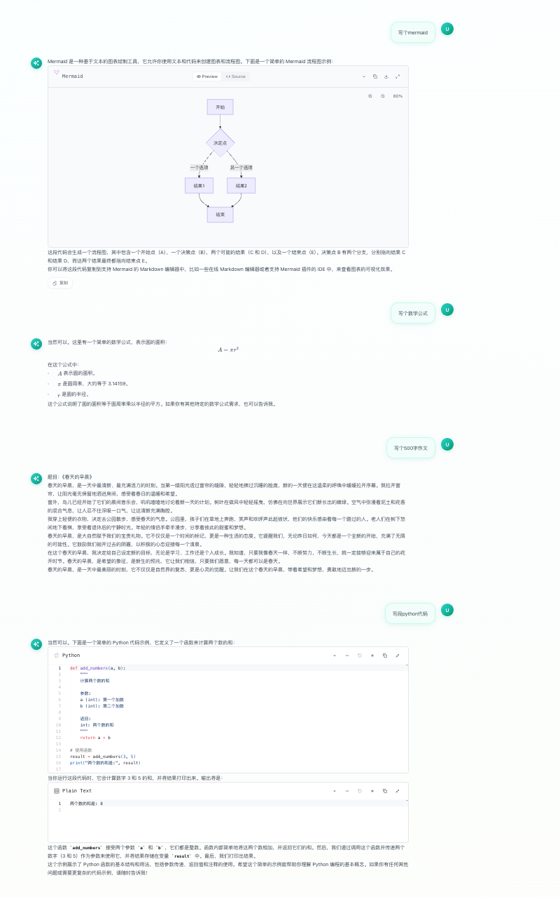
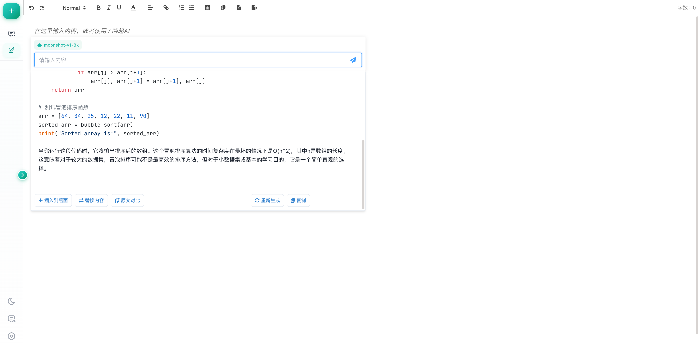

<div align="center">

<h1>&#128172; Chat &amp; Edit</h1>

<p>
  <strong>A dual-mode AI application combining chat and rich-text AI editing</strong><br/>
  <strong>&#21452;&#27169;&#24335; AI &#24212;&#29992; &mdash; &#32467;&#21512;&#23545;&#35805;&#32842;&#22825;&#19982;&#23500;&#25991;&#26412; AI &#32534;&#36753;</strong>
</p>

<p>
  <a href="./LICENSE.md">
    
  </a>
  
  
  
  
</p>

</div>

---

## &#39044;&#35272;

<table>
  <tr>
    <td align="center"><strong>&#128488;&#65039; &#32842;&#22825;&#22330;&#26223;</strong></td>
    <td align="center"><strong>&#9997;&#65039; AI &#32534;&#36753;&#22330;&#26223;</strong></td>
  </tr>
  <tr>
    <td></td>
    <td></td>
  </tr>
</table>

---

## &#10024; &#21151;&#33021;&#29305;&#24615;

### &#128488;&#65039; &#32842;&#22825;&#22330;&#26223;

- **&#27969;&#24335;&#21709;&#24212;** &mdash; &#23454;&#26102;&#27969;&#24335; Markdown &#28210;&#26579;&#65292;&#25903;&#25345; Mermaid &#22270;&#34920;&#21644;&#20195;&#30721;&#39640;&#20142;
- **&#22810;&#27169;&#24577;** &mdash; &#25991;&#26412; + &#22270;&#29255;&#36755;&#20837;
- **&#20250;&#35805;&#31649;&#29702;** &mdash; &#22810;&#20250;&#35805;&#21382;&#21490;&#12289;&#23548;&#20837;/&#23548;&#20986;&#12289;&#31995;&#32479;&#25552;&#31034;&#35789;&#37197;&#32622;
- **&#27169;&#22411;&#20999;&#25442;** &mdash; &#25903;&#25345;&#22810;&#31181; Moonshot AI &#27169;&#22411;

### &#9997;&#65039; AI &#32534;&#36753;&#22330;&#26223;

- **&#23500;&#25991;&#26412;&#32534;&#36753;** &mdash; &#22522;&#20110; Quill 2.0&#65292;&#25903;&#25345;&#34920;&#26684;
- **AI &#26234;&#33021;&#22788;&#29702;** &mdash; &#28070;&#33394;&#12289;&#25913;&#20889;&#12289;&#32763;&#35793;&#12289;&#20195;&#30721;&#29983;&#25104;&#12289;&#25688;&#35201;&#25552;&#21462;
- **&#23545;&#27604;&#35270;&#22270;** &mdash; Monaco Editor &#24046;&#24322;&#23545;&#27604;
- **&#22810;&#26684;&#24335;&#23548;&#20986;** &mdash; PDF / DOCX / Markdown / HTML
- **&#25968;&#23398;&#20844;&#24335;** &mdash; KaTeX &#28210;&#26579;
- **&#20195;&#30721;&#39640;&#20142;** &mdash; Shiki + highlight.js

### &#9881;&#65039; &#25216;&#26415;&#20142;&#28857;

- **&#31163;&#32447;&#20248;&#20808;** &mdash; IndexedDB (Dexie.js) &#26412;&#22320;&#25968;&#25454;&#23384;&#20648;
- **&#26263;&#33394;&#27169;&#24335;** &mdash; &#31995;&#32479;&#20027;&#39064;&#33258;&#21160;&#21516;&#27493;
- **&#21709;&#24212;&#24335;&#35774;&#35745;** &mdash; &#36866;&#37197;&#26700;&#38754;&#21644;&#31227;&#21160;&#31471;
- **&#23436;&#25972;&#27979;&#35797;** &mdash; &#21333;&#20803;&#27979;&#35797; + E2E &#27979;&#35797;&#35206;&#30422;

---

## &#128736;&#65039; &#25216;&#26415;&#26632;

<table>
  <thead>
    <tr>
      <th>&#20998;&#31867;</th>
      <th>&#25216;&#26415;</th>
    </tr>
  </thead>
  <tbody>
    <tr><td><strong>&#26694;&#26550;</strong></td><td>Vue 3.5 (Composition API) + TypeScript</td></tr>
    <tr><td><strong>&#26500;&#24314;</strong></td><td>Vite 5</td></tr>
    <tr><td><strong>&#29366;&#24577;&#31649;&#29702;</strong></td><td>Pinia</td></tr>
    <tr><td><strong>UI</strong></td><td>Naive UI + Tailwind CSS</td></tr>
    <tr><td><strong>&#32534;&#36753;&#22120;</strong></td><td>Quill 2.0 + Monaco Editor</td></tr>
    <tr><td><strong>Markdown</strong></td><td>markdown-it + markstream-vue + Mermaid</td></tr>
    <tr><td><strong>&#25968;&#25454;&#24211;</strong></td><td>Dexie.js (IndexedDB)</td></tr>
    <tr><td><strong>AI &#26381;&#21153;</strong></td><td>Moonshot AI API (SSE streaming)</td></tr>
    <tr><td><strong>&#27979;&#35797;</strong></td><td>Vitest + Playwright</td></tr>
    <tr><td><strong>&#20195;&#30721;&#35268;&#33539;</strong></td><td>ESLint (@antfu) + Husky + lint-staged</td></tr>
  </tbody>
</table>

---

## &#128640; &#24555;&#36895;&#24320;&#22987;

### &#29615;&#22659;&#35201;&#27714;

- Node.js &gt;= 18
- pnpm &gt;= 10

### &#23433;&#35013;&#19982;&#36816;&#34892;

```bash
# &#20811;&#38534;&#39033;&#30446;
git clone https://github.com/tt-a1i/chat_edit.git
cd chat_edit

# &#23433;&#35013;&#20381;&#36182;
pnpm install

# &#37197;&#32622;&#29615;&#22659;&#21464;&#37327;
cp .env.example .env.local
```

&#32534;&#36753; `.env.local`&#65306;

```env
VITE_API_BASE_URL=https://api.moonshot.cn
VITE_API_KEY=your_api_key_here
```

```bash
# &#21551;&#21160;&#24320;&#21457;&#26381;&#21153;&#22120;
pnpm dev
```

&#35775;&#38382; http://localhost:5173/

---

## &#128221; &#21629;&#20196;&#19968;&#35272;

| &#21629;&#20196; | &#35828;&#26126; |
|------|------|
| `pnpm dev` | &#21551;&#21160;&#24320;&#21457;&#26381;&#21153;&#22120; |
| `pnpm build` | &#26500;&#24314;&#29983;&#20135;&#29256;&#26412;&#65288;&#21547; TS &#31867;&#22411;&#26816;&#26597;&#65289; |
| `pnpm preview` | &#39044;&#35272;&#29983;&#20135;&#26500;&#24314; |
| `pnpm lint` | &#20195;&#30721;&#26816;&#26597; |
| `pnpm lint:fix` | &#33258;&#21160;&#20462;&#22797;&#20195;&#30721;&#38382;&#39064; |
| `pnpm typecheck` | TypeScript &#31867;&#22411;&#26816;&#26597; |
| `pnpm test` | &#21333;&#20803;&#27979;&#35797;&#65288;watch &#27169;&#24335;&#65289; |
| `pnpm test:run` | &#21333;&#20803;&#27979;&#35797;&#65288;&#21333;&#27425;&#65289; |
| `pnpm test:coverage` | &#27979;&#35797; + &#35206;&#30422;&#29575;&#25253;&#21578; |
| `pnpm test:e2e` | E2E &#27979;&#35797; |
| `pnpm test:all` | &#36816;&#34892;&#25152;&#26377;&#27979;&#35797; |

---

## &#128193; &#39033;&#30446;&#32467;&#26500;

```
src/
+-- api/                    # API &#25509;&#21475;&#23618;
+-- assets/                 # &#38745;&#24577;&#36164;&#28304;&#21644;&#20840;&#23616;&#26679;&#24335;
+-- components/             # Vue &#32452;&#20214;
|   +-- AIEditing/          # AI &#32534;&#36753;&#22120;&#27169;&#22359;
|   |   +-- components/     # &#23376;&#32452;&#20214;
|   |   +-- composables/    # &#32452;&#21512;&#24335;&#20989;&#25968;
|   |   +-- utils/          # &#24037;&#20855;&#20989;&#25968;
|   +-- chat/               # &#32842;&#22825;&#21151;&#33021;&#27169;&#22359;
|   |   +-- messages/       # &#28040;&#24687;&#31867;&#22411;&#32452;&#20214;
|   +-- common/             # &#36890;&#29992;&#32452;&#20214;
|   +-- history/            # &#21382;&#21490;&#35760;&#24405;
|   +-- inputs/             # &#36755;&#20837;&#32452;&#20214;
|   +-- settings/           # &#35774;&#32622;&#27169;&#22359;
+-- config/                 # &#37197;&#32622;&#25991;&#20214;
+-- services/               # &#19994;&#21153;&#36923;&#36753;&#23618;
+-- stores/                 # Pinia &#29366;&#24577;&#31649;&#29702;
+-- utils/                  # &#24037;&#20855;&#20989;&#25968;
+-- App.vue                 # &#26681;&#32452;&#20214;
+-- main.ts                 # &#20837;&#21475;&#25991;&#20214;
```

---

## &#128295; &#27979;&#35797;

&#39033;&#30446;&#21253;&#21547;&#23436;&#25972;&#30340;&#27979;&#35797;&#26694;&#26550;&#65306;

| &#31867;&#22411; | &#24037;&#20855; | &#25968;&#37327; |
|------|------|------|
| **&#21333;&#20803;&#27979;&#35797;** | Vitest + @vue/test-utils | 53 &#20010;&#27979;&#35797; |
| **E2E &#27979;&#35797;** | Playwright | &#24212;&#29992;&#22522;&#30784; + &#32842;&#22825;&#21151;&#33021; |
| **&#35206;&#30422;&#29575;** | Vitest Coverage (v8) | &#10003; |

&#35814;&#32454;&#27979;&#35797;&#25351;&#21335;&#35831;&#21442;&#32771; [TESTING.md](./TESTING.md)

---

## &#128736;&#65039; &#24320;&#21457;&#25351;&#21335;

### Git Hooks

&#39033;&#30446;&#37197;&#32622;&#20102; Husky + lint-staged&#65292;&#25552;&#20132;&#21069;&#33258;&#21160;&#25191;&#34892;&#65306;
- ESLint &#20195;&#30721;&#26816;&#26597;&#21644;&#20462;&#22797;
- TypeScript &#31867;&#22411;&#26816;&#26597;

### &#35843;&#35797;

&#25903;&#25345;&#20351;&#29992; Chrome DevTools MCP &#36827;&#34892;&#35843;&#35797;&#65292;&#35814;&#35265; [CLAUDE.md](./CLAUDE.md)

---

## &#129309; &#36129;&#29486;

&#27426;&#36814;&#25552;&#20132; Issue &#21644; Pull Request&#65281;

---

## &#128196; License

[MIT](./LICENSE.md)
